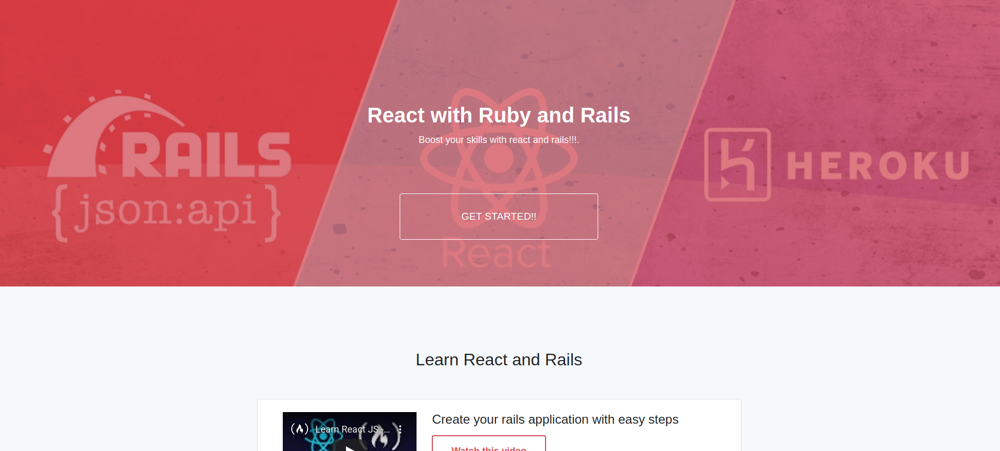

[![Contributors][contributors-shield]][contributors-url]
[![Forks][forks-shield]][forks-url]
[![Stargazers][stars-shield]][stars-url]
[![Issues][issues-shield]][issues-url]
[![LinkedIn][linkedin-shield2]][linkedin-url2]

<!-- PROJECT LOGO -->
 

 <h2 align="center"> Mini Course webside using react with ruby and rails </h2>

  

      In this project we developed a webside that shows a mini course with
different videos and plays every video when it is selected.
     
    <a href="https://github.com/YairFernando67/course-app"><strong>Explore the docs »</strong></a>
     
     
    <a href="https://github.com/YairFernando67/course-app">View Demo</a>
    ·
    <a href="https://github.com/YairFernando67/course-app/issues">Report Bug</a>
    ·
    <a href="https://github.com/YairFernando67/course-app/issues">Request Feature</a>
  

## Table of Contents
* [About the Project](#about-the-project)
  * [Styled Components](#Styled-Components)
  * [Built With](#built-with)
* [Contact](#contact)

## About The Project

 

### Styled Components
* Styled Components allow you to write plain CSS in your components without worrying about class name collisions. 
* It helps to write CSS that's scoped to a single component and does not leak to any other element in the page

### Built With
The project was developed using the following technologies:
- [REACT](https://es.reactjs.org/)
- [JSX](https://reactjs.org/docs/introducing-jsx.html)
- [AXIOS](https://github.com/axios/axios)
- [RUBY](https://www.ruby-lang.org/es/)
- [RUBY AND RAILS](https://rubyonrails.org/)
- [BOOTSTRAP](https://getbootstrap.com/docs/4.3/getting-started/introduction/)
- [STYLED-COMPONENTS](https://www.styled-components.com/)
- [WEBPACKER](https://github.com/rails/webpacker)

## Contact

👤 **Yair Fernando Facio**

- Github: [@YairFernando67](https://github.com/YairFernando67)
- Twitter: [@YairFernando18](https://twitter.com/YairFernando18)
- Linkedin: [softwaredeveloperyairfacio](https://www.linkedin.com/in/softwaredeveloperyairfacio/)
- Email: [yair.facio11@gmail.com](https://mail.google.com/mail/?view=cm&fs=1&tf=1&to=yair.facio11@gmail.com)
- Portfolio: [softwaredeveloper](https://yairfernando67.github.io/Portfolio/)

  Project Link: [https://github.com/YairFernando67/course-app](https://github.com/YairFernando67/course-app)

## 🤝 Contributing

Contributions, issues and feature requests are welcome!

Feel free to check the [issues page](https://github.com/YairFernando67/course-app/issues).

## Show your support

Give a ⭐️ if you like this project!

<!-- MARKDOWN LINKS & IMAGES -->
[contributors-shield]: https://img.shields.io/github/contributors/YairFernando67/course-app.svg?style=flat-square
[contributors-url]: https://github.com/YairFernando67/course-app/graphs/contributors
[forks-shield]: https://img.shields.io/github/forks/YairFernando67/course-app.svg?style=flat-square
[forks-url]: https://github.com/YairFernando67/course-app/network/members
[stars-shield]: https://img.shields.io/github/stars/YairFernando67/course-app.svg?style=flat-square
[stars-url]: https://github.com/YairFernando67/course-app/stargazers
[issues-shield]: https://img.shields.io/github/issues/YairFernando67/course-app.svg?style=flat-square
[issues-url]: https://github.com/YairFernando67/course-app/issues
[license-shield]: https://img.shields.io/github/license/YairFernando67/course-app.svg?style=flat-square
[license-url]: https://github.com/YairFernando67/course-app/blob/master/LICENSE.txt
[linkedin-shield2]: https://img.shields.io/badge/-LinkedIn-black.svg?style=flat-square&logo=linkedin&colorB=555
[linkedin-url2]: https://www.linkedin.com/in/softwaredeveloperyairfacio/

